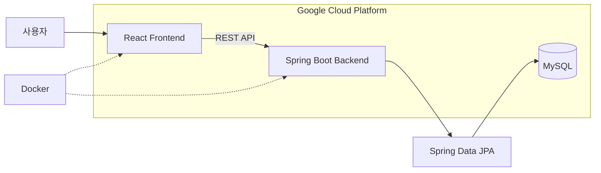
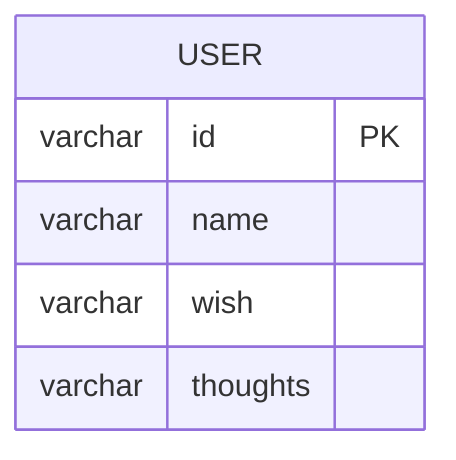
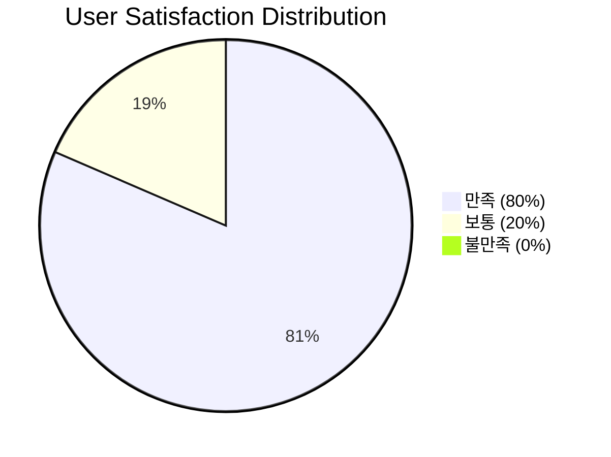

# 💌 다시,ON Backend

> 강원대학교 미디어커뮤니케이션학과 학술제를 위해 제작한 온라인 편지함 모바일 웹서비스의 백엔드 프로젝트


## 📌 프로젝트 소개

다시,ON은 강원대학교 미디어커뮤니케이션학과 학술제를 위해 제작한 **온라인 편지함 모바일 웹서비스**입니다.

학과로부터 전달받은 서비스 제안서를 기반으로 2명이 개발했으며, Backend에서는 Spring Boot 기반 REST API와 MySQL 데이터베이스를 연동하여 사용자가 작성한 데이터를 저장하는 기능을 구현했습니다.

React Frontend와 Spring Boot Backend, MySQL Database를 연동하고 Docker를 이용해 애플리케이션 실행 환경을 구성했으며, Google Cloud Platform의 서버를 통해 실제 학술제에서 서비스를 운영했습니다.

- 개발 형태: 2인 프로젝트
- 담당 역할: Full Stack 개발
- 서비스 대상: 강원대학교 미디어커뮤니케이션학과 학술제
- 실제 서비스 사용자: 27명
- 사용자 설문 만족도: 80% 이상
- Frontend Repository: [다시,ON_FE](https://github.com/woohyun1007/promotionFE)
- Notion : [다시,ON_BE 상세 문서](https://app.notion.com/p/ON-BE-3c0b883853bf8093b62ac56c255aa0df?source=copy_link)

## 🛠 기술 스택

| 구분            | 기술                                |
| ------------- | --------------------------------- |
| Language      | Java 17                           |
| Backend       | Spring Boot, Spring MVC           |
| Data          | Spring Data JPA, Hibernate, MySQL |
| Security      | Spring Security                   |
| Build         | Gradle                            |
| Deployment    | Docker, Google Cloud Platform     |
| Collaboration | Git, GitHub                       |

## 🏗 시스템 아키텍처



## 📂 프로젝트 구조

```text
src/main/java/com/example/firstproject
├── config
│   └── SecurityConfig.java    # Spring Security 및 CORS 설정
├── controller
│   └── UserController.java    # 사용자 데이터 REST API
├── entity
│   └── User.java              # 사용자 입력 데이터 Entity
├── repository
│   └── UserRepository.java    # JPA 기반 데이터 접근
├── service
│   └── UserService.java       # 사용자 데이터 저장 로직
└── FirstprojectApplication.java
```

## 🗄 ERD



사용자가 입력한 정보를 하나의 `User` Entity로 관리하도록 구성했습니다.

| 필드       | 설명                |
| -------- | ----------------- |
| id       | 사용자 식별값           |
| name     | 사용자 이름            |
| wish     | 사용자가 작성한 소망       |
| thoughts | 사용자가 작성한 생각 및 메시지 |

## ✨ 주요 기능

| 도메인      | 구현 기능                                                     |
| -------- | --------------------------------------------------------- |
| 사용자 데이터  | React에서 전달받은 사용자 입력 데이터 저장                                |
| REST API | JSON 기반 Frontend ↔ Backend 데이터 통신                         |
| 데이터베이스   | Spring Data JPA를 이용한 MySQL 데이터 저장                         |
| CORS     | React Frontend 서버의 API 요청을 허용하도록 CORS 설정                  |
| 보안 설정    | Spring Security Filter Chain을 이용한 요청 접근 정책 설정             |
| 배포       | Docker Image 기반 Spring Boot 애플리케이션 실행                     |
| 운영       | Google Cloud Platform 환경에서 Frontend, Backend, Database 연동 |

## 🚀 실행 방법

### 1. 요구사항

* Java 17
* MySQL 8.x
* Docker (컨테이너 실행 시)

### 2. 저장소 복제

```bash
git clone <다시ON_Backend_Repository_URL>
cd promotionBE
```

### 3. 데이터베이스 설정

`application.properties` 또는 별도의 환경 설정 파일에 MySQL 연결 정보를 설정합니다.

```properties
spring.datasource.url=jdbc:mysql://localhost:3306/mediadb?serverTimezone=Asia/Seoul&characterEncoding=UTF-8
spring.datasource.username=your_username
spring.datasource.password=your_password

spring.datasource.driver-class-name=com.mysql.cj.jdbc.Driver

spring.jpa.hibernate.ddl-auto=update
spring.jpa.show-sql=true
```

> 실제 운영 환경의 데이터베이스 주소, 계정 및 비밀번호와 같은 민감 정보는 Repository에 직접 포함하지 않고 환경 변수 또는 별도의 설정 파일을 이용해 관리하는 것을 권장합니다.

### 4. 애플리케이션 실행

```bash
./gradlew bootRun
```

Windows에서는 다음 명령을 사용합니다.

```powershell
.\gradlew.bat bootRun
```

### 5. Docker 실행

먼저 애플리케이션을 Build합니다.

```bash
./gradlew build
```

Docker Image를 생성합니다.

```bash
docker build -t promotion-be .
```

Container를 실행합니다.

```bash
docker run -p 8080:8080 promotion-be
```

## 📊 운영 결과

강원대학교 미디어커뮤니케이션학과 학술제에서 실제 서비스를 운영했습니다.

* 총 서비스 사용자: **27명**
* 사용자 설문 만족도: **80% 이상**
* 불만족 응답: **0%**



개발 단계에서 끝나는 프로젝트가 아니라 React Frontend, Spring Boot Backend, MySQL Database를 실제 서버 환경에서 연동하고 사용자에게 서비스를 제공하는 과정까지 경험했습니다.
